 

  

---

## 👤 Professional Overview

  

 

Software Engineer focused on building modern, scalable and maintainable solutions across the full stack.  
I work with a strong engineering mindset, emphasizing clean architecture, performance, developer experience, and real-world product value.

My work spans frontend architecture, backend services, APIs, cloud integrations, automation workflows, and production-ready applications designed for growth.

---

## 🛠️ Core Technology Stack

### Languages

### Frontend

### Backend

### Databases & Storage

### DevOps · Cloud · Infrastructure

### Testing & Engineering Tools

---

## 📊 GitHub Analytics

&nbsp;

  

  

---

## 🏆 Achievements

---

## 🚀 Featured Projects

&nbsp;

---

## 💡 Engineering Focus

Clean Architecture • Scalable Systems • API Design • Performance • Cloud Integration • Developer Experience • Automation • Full Stack Delivery

---

## 🤝 Let’s Connect

  

*“Good programmers write code that humans can understand.”*  
**— Martin Fowler**

 

